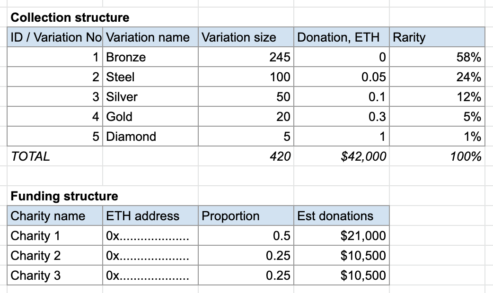

         

<iframe src="https://discord.com/widget?id=896074156121137183&theme=dark" width="350" height="500" allowtransparency="true" frameborder="0" sandbox="allow-popups allow-popups-to-escape-sandbox allow-same-origin allow-scripts"></iframe>

# NFMT

Q: What is NFMT?

A: "Never Forget" Memory/Meme Token

It is an NFT-based smart contract that allows users to simultaneously collect digital memorabilia and donate to the causes they care about. 
Our inspiration is current (2022) Ukrainian 🇺🇦 fight for freedom and survival, but the format can be applied to other charitable causes too.

Q: What is the mechanism of NFMT?

A: Users can mint "remembrance", "meme" or "charitable cause" tokens for free or including an optional donation. All donations are immediately sent to the charities hard-coded into the collection smart contract.

The mechanism is described in detail below.

**READ THE CODE 🤓**

It might be actually easier for you to read the contract code: [https://github.com/dappros/nfmt/blob/main/contracts/contracts/NFMT.sol](https://github.com/dappros/nfmt/blob/main/contracts/contracts/NFMT.sol) as it has detailed comments in English 🇬🇧🇺🇸 and Ukrainian 🇺🇦. 

### Main scenario - mints and donations
1. Collection admin deploys the contract, setting the desired variation sizes, donation amounts, wallet address for charities and the desired proportions for charities. [ This can be done directly in the contract constants ]
2. Users mint tokens via web interface or directly via Etherscan, optionally sending a donation.
3. Collection contract mints the respective variation for the user if the variation limit hasn't been reached and the donation is sufficient.
4. Collection contract pays out the obtained donation to charities according to proportions.

### Additional scenario - secondary market
Collection admin should also set up a resell commission at OpenSea and other similar marketplaces (for example, 2.4%).

For beneficiary contract admin should set up the address of the deployed collection contract.

If receiving any commission / royalty from OpenSea and other marketplacse, or donation payments directly from wallets, contract should accumulate such donations.

1. Anybody (not just admin) can call a "withdraw" function specifying one of the withdrawal addresses. 
2. Contract verifies that the specified withdrawal address matches one of the addresses that are pre-defined in the contract.
3. This transfers any proportional ETH accumulated for the given address to the given charity wallet.

This is needed so that withdrawals can happen to charities one by one, for example one of them has lost access to their wallet, so there is no need to waste gas fees on withdrawing there.

## Project inspiration / background

### NFMT acronym - what does it mean?

Note: the NFMT acronym can be interpreted in different ways. The initial interpretation ("Never Forget" Memory Token) reflects my (Taras Filatov) insipration to start this. 

The best recognition however would be the community adoption and it is inevitable that many projects and applications might branch into topics that have nothing to do with "Never Forget". In such case the community can apply or develop more universally fitting interpretations, such for example as "__Nearly Fungible Multi Token__" or "__Meme Token__". This is welcome - if this project helps someone maybe there is a tiny proportion of people who will read the history behind it and think about that stuff.  

I wrote this in my Facebook today on 8th May 2022:

===

_WW2 Remembrance Day (Victory in Europe) today._

_Over 1.3m (!) Ukrainian soldiers have died in the battles against the nazists during WW2._

_Total human losses of Ukraine including civilian and deported people over 10m during 1939-1945._

_Ukrainian Army is now fighting to fulfill that "Never Again" - to protect Europe and the World against another catastrophe driven by a crazy dictator and a brainwashed nation._

===

It was important for me to launch this project on this date. I devote it to the defenders of freedom, peace and civilization who fight protecting our world from barbarism and destruction. These days Ukrainian army continues its heroic fight writing fresh lines into world history, with their blood, sweat and tears. The war that is happening now is a mistake, like many wars before that. Those who don't know history are doomed to repeat it (c) Winston Churchill. 

## Core difference from NFT

NFMT is similar to NFT tokens, but it allows anybody who sees a token they like, to mint a copy of such NFMT token, for free (just paying the gas fees).

This type of contract will work well for cases where users want to save a copy of a content focused digital asset such a photograph, digital collectible, memorabilia, text, music, video, meme to their own wallet, therefore helping to create an immutable digital trace, "memory" of this item on blockchain. Content stored this way can be accessed by the wallet owner as well as other users. 

Core difference here is that the issuance is unlimited and users can mint as many copies as they want, as long as they want it and the pay the gas fee.

## Future plans

* Fundraising / chariry aspect - minting a copy requies a fee that goes to designated charities
* Payments / commissions to mint going to the owners of the rights if it is a copyrighted material.

## Crypto Tokens -> NFT -> Meme Tokens

As both user and technologist, I find the NFT format both facinating and limited. Cryptocurrencies and fungible tokens such as ERC-20 have changed our life enormously offering a way to create and trade digital money in a decentralized and trustless way, without the need for any intermediaries or gatekeepers. They have been successfull but were missing "soul" limiting its adoption by the public. NFT tokens have appeared later to become extremely popular with wide masses of users as they focused on the art, the act of creation and the content. This has added "soul" or at least face and individuality to cryptographic tokens.

NFTs however have their own limitations. It is almost certain, of course, that these limitations will be overcome through evolution and projects like this one that attempt to improve upon the standard. "Now it is our turn to study statistical mechanics".

What I personally find lacking in NFTs, or should we say generally in current decentralized economy tech around the content.

## __1. Memes and file attachments.__
Users can post memes and stickers on social media. You can copy an existent meme or slightly modify it. You can install sticker packs. Why can't the same be done with NFTs? I understand that NFTs are "non-fungible" and that some / most of them include rights to the content presented in them (not really - read for example the small T&C print in the NBA Top Shot NFT tokens etc - but let's pretend legally it is the case). There would however be cases where copying is allowed - such as 'fair use' similar to what happens with memes, or in case where the copyright owner is actually happy for their content to be distributed (see "Creative Commons" and other similar licenses).

Here I should also mention another inspiration or a pain point that has led to this project. I wanted to __marry NFTs with files that people send or keep in their profiles__. As in messengers and social networks. You can post and send files, but they are not NFTs. Why don't we allow all those files to be NFTs - whenever users want? We have a product called Ethora (github repo: https://github.com/dappros/ethora) where users can mint NFTs as simple as pick a file from your phone gallery, upload and - boom - it's in your wallet and is show in your profile. You can then go and send it to other users in a chat. Users in the chat can tap on each other profiles and see what NFTs users own, view those images, play videos and music etc. 

Now, coming closer to our topic - another feature we are adding now in Ethora is a possibility to convert a file seen somewhere in the chat (file attachments) into NFTs. Actually all attachments can be NFTs, or provisional NFTs, as long as community is happy no rights are violated and users or the system are happy to pay the gas fees.

## __1.1. "Stealing" the meme.__
Continuing the discourse within our social / messaging context, it is perfectly OK for someone to "steal" a meme or install the same sticker pack if they like something that has been shared online by another user. It is not OK and is normally impossible to steal an NFT by copying (well, again that has been a laughing matter for some, but we won't go into that here - technically you can copy but it will be a different token with different provenance). For NFMTs however it is perfectly OK to "steal" it. It is allowed and encouraged to mint your own copies of NFMT. Smart contract fully supports that. 

OK so we have figured out that duplicating or cloning NFTs could be useful in some applications as long as we can technically implement it and all sides are happy.

## __2. Decentralized Copyright handling.__

Now, this is a huge topic so I will just explain it very roughly and very far from professional legal language. The way I feel about this as a user and a tech enterpreneur. 

The way copyright and media licensing is handled currently is very inefficient. It can and should be revolutionazed with smart contracts. 

Let me explain the pain point. I want to be able to create a Youtube video and put my favourite Metallica song as a background music. I'm happy for the band to receive any revenues from the ads that Youtube runs etc. I'm not selling my video, I just put it out there for free. Metallica could actually be happy if thousands of people add their music to their videos and millions of ad views generate revenues for them. This isn't how it works currently sadly. You are supposed to get an explicit permit from the artist. That is fair of course, what I believe is wrong about this is that there is no smart contract or a decentralized platform which allows Metallica to pre-approve the transactional use of their songs and automatically get revenues from each use. All miss out here - the artist, the derivative content maker and the end user. 

## __2.1 Solution: Automated royalties.__

Our NFMT therefore should include logic that allows the content copyright owner to automatically receive royalties every time someone benefits from it in a way that generates profits. 

Now, there are a couple problems with that if implementing this via smart contracts.

1) How do you determine what value/benefit/profit has someone obtained?
2) How do you make sure that the copyright owner is established correctly and the right people/entities will receive the royalties?

Some of these can be solved technically by programming misc logic, for example every time NFMT is opened or played, the platform should track that and transfer royalties via microtransactions. In case ads are being shown or these NFMT being sold somehow, it is even simpler as the revenue will be easy to determine. 

Not everything here is possible to solve though, therefore I propose two approaches for the first implementations of NFMT standard:

## Public Declaration (User self-certifies) + Walled Garden Ecosystem

(short-term solution)

Here our solution is following:
1. Get all users to certify they have the rights to post the content that they post.
2. Get all users enter into an agreement that all content they post can be copied by other users akin to "Creative Commons" license.
3. Enjoy the "walled garden" club where everybody can post and reuse content freely.

## Content Rights and Royalties DAO ##

(long-term solution)

A DAO governance mechanism should be established that allows the community to reach consensus in relation to possible conflicts regarding ownership rights and royalties distribution. This will allow to resolve any inevitable conflicts and also this should include a mechanism for reflecting any decisions made by real-world "offchain" courts.

## Automated donation / charity payments ##

Similar to the abovementioned built-in royalty payments which can be categorized as "compulsory donations", I believe it is very important for NFMTs to include a standard mechanism for voluntary donations. 

Example: I want to create an NFMT-based meme/sticker pack devoted to Ukrainian army and Ukrainian people. Each mint requires a small payment and the whole amount of payment automatically gets sent to charities such as "Come back alive" https://www.comebackalive.in.ua/ etc.   

This, in my opinion, is even more important than royalties payments, especially in the initial intended context of NFMT which is likely to use content that isn't subject to copyright, or the author has agreed for it to be used, however an important motivating factor driving the users to display and share such NFTs is their knowledge that they contribute to the social/viral spread of a charitable donations campaign. 

This mechanism can, of course, be used to support various means that appeal to specific communities. 

Importantly, standard token and smart contract methods allow us to support multiple causes and charities. For example, each token minted can automatically send a payment to an ecology / carbon offset charity in addition to the main cause it was issued for. 

## Royalties / Donations "cap table" - DAO payouts

To be continued..

## Copyright Owner compensation Pot

Is there a way to allow a fast spreading meme to be copied and sent around as much as possible, while at the same time safeguarding against any possible copyright infringement? Indeed, we can rely on a declaration by a user who uploads the content first but we have no way to verify if the user is indeed a copyright owner or the content is indeed free of copyright limitations. 

One way to deal with this would be a "Compensation Pot", or an escrow account scheme where a portion of any fees gained by the token gets accummulated in a special reserve account that can only be withdrawn if governing DAO decides so (and / or when a condition is met, for example 180 days have passed since funds been accummulated). This savings pot will be used to pay compensations or resolve disputes in case they arise.

